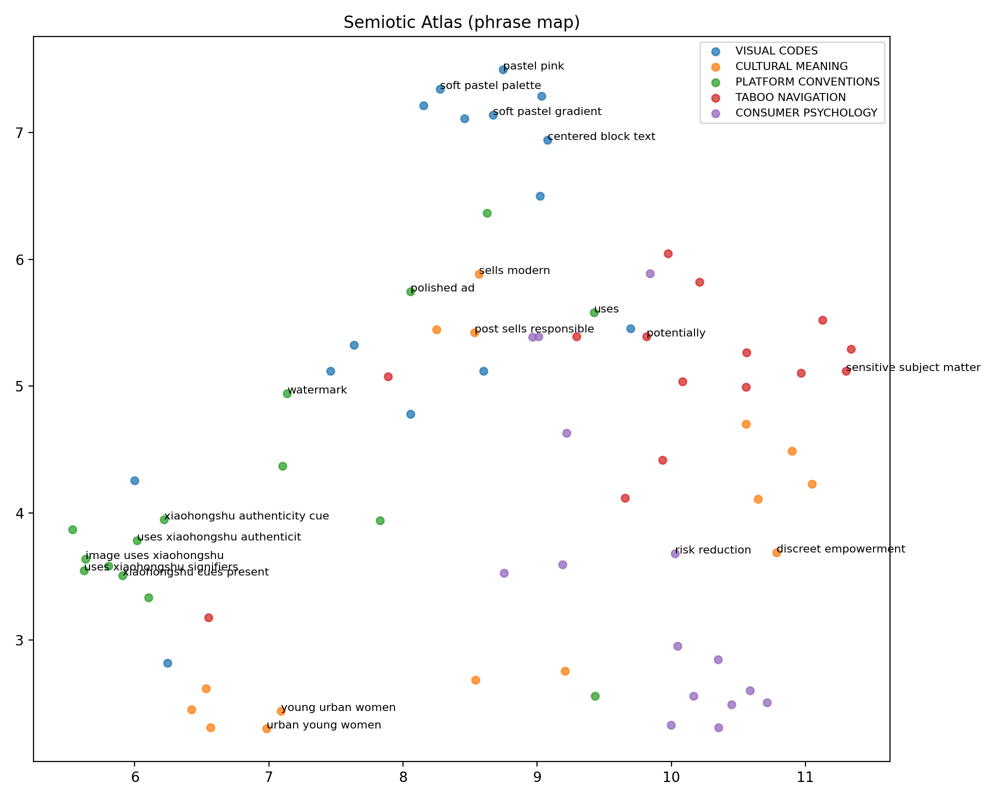
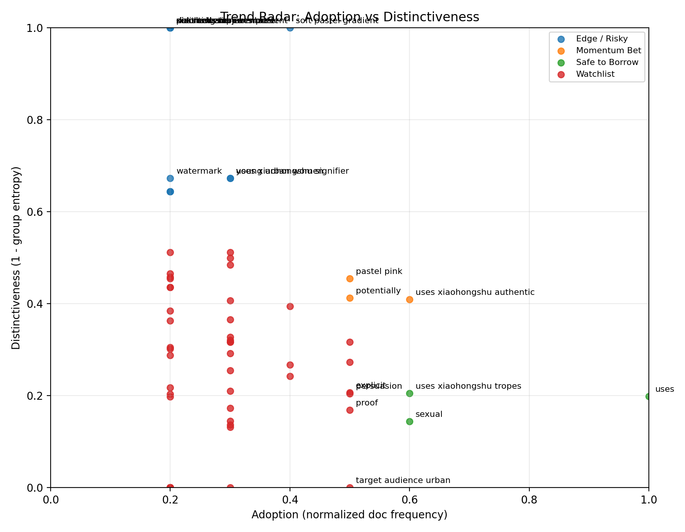

# Semiotic Outputs

## Figures

## Brand Playbook (Auto)

### Safe to Borrow
- **uses** (PLATFORM CONVENTIONS) — adoption=1.00, distinctive=0.20; e.g., *Uses Xiaohongshu signifiers—step-by-step checklist, emoji-like badges, lifestyle photography aesthetics, and an informal advisory voice—mimicking influencer/UGC*
- **uses xiaohongshu tropes** (PLATFORM CONVENTIONS) — adoption=0.60, distinctive=0.21; e.g., *Uses Xiaohongshu tropes—informational, peer‑to‑peer tone, numbered pros/cons, conversational Mandarin, and a nonce authority (“正经科普”) to mimic authentic reviewe*
- **sexual** (TABOO NAVIGATION) — adoption=0.60, distinctive=0.14; e.g., *Potentially sensitive topics (intimate/sexual products implied by material discussion) are depersonalized through clinical language, "科普" framing, and focus on *

### Momentum Bet
- **uses xiaohongshu authenticity** (PLATFORM CONVENTIONS) — adoption=0.60, distinctive=0.41; e.g., *Uses Xiaohongshu authenticity markers—concise explanatory text, soft lifestyle visuals, and community-friendly tone—suggesting peer-to-peer advice rather than c*
- **pastel pink** (VISUAL CODES) — adoption=0.50, distinctive=0.45; e.g., *Pastel pink-to-blue gradient, soft lighting and large bold typography create a contemporary, millennial-friendly aesthetic that reads as both romantic and clini*
- **potentially** (TABOO NAVIGATION) — adoption=0.50, distinctive=0.41; e.g., *Potentially sensitive topics (intimate/sexual products implied by material discussion) are depersonalized through clinical language, "科普" framing, and focus on *

### Edge / Risky
- **soft pastel gradient** (VISUAL CODES) — adoption=0.40, distinctive=1.00; e.g., *Soft pastel gradient (pink to purple) and rounded white text blocks create a reassuring, feminine aesthetic; bold black headline in a condensed, slightly retro *
- **young urban women** (CULTURAL MEANING) — adoption=0.30, distinctive=0.67; e.g., *Target audience: young urban women (20s–30s) who follow trends, prioritize appearance and discreet sexual health.*
- **uses xiaohongshu signifiers** (PLATFORM CONVENTIONS) — adoption=0.30, distinctive=0.67; e.g., *Uses Xiaohongshu signifiers—step-by-step checklist, emoji-like badges, lifestyle photography aesthetics, and an informal advisory voice—mimicking influencer/UGC*
- **post sells responsible** (CULTURAL MEANING) — adoption=0.20, distinctive=1.00; e.g., *The post sells responsible, informed modern femininity—sexual health framed as manageable, consumerized knowledge—appealing to urban, young adult women who valu*
- **discreet empowerment** (CULTURAL MEANING) — adoption=0.20, distinctive=1.00; e.g., *It also signals modernity and discreet empowerment: control over pleasure framed as fashionable consumption.*
- **sensitive subject matter** (TABOO NAVIGATION) — adoption=0.20, distinctive=1.00; e.g., *Sensitive subject matter is domesticated via educational framing (“basic knowledge”), euphemistic language, pastel palette, and checklist format—transforming er*
- **xiaohongshu cues present** (PLATFORM CONVENTIONS) — adoption=0.20, distinctive=1.00; e.g., *Xiaohongshu cues are present: username/branding watermark, checklist/infographic format, and conversational copy that reads like an influencer post or mini-guid*
- **polished ad** (PLATFORM CONVENTIONS) — adoption=0.20, distinctive=1.00; e.g., *The image uses Xiaohongshu tropes—flat-lay, product lineup, and conversational overlay copy—mimicking influencer unboxing/recommendation formats; authenticity m*
- **risk reduction** (CONSUMER PSYCHOLOGY) — adoption=0.20, distinctive=1.00; e.g., *Persuasion relies on competence signaling and risk reduction: concrete metrics + normative warnings reduce uncertainty and anxiety, nudging purchase/trial by pr*
- **watermark** (PLATFORM CONVENTIONS) — adoption=0.20, distinctive=0.67; e.g., *Features typical 小红书 cues—personal handle watermark (@小花的恋爱指南), pastel visual branding, short didactic copy, and an influencer-as-friend voice that signals peer*
- **soft pastel palette** (VISUAL CODES) — adoption=0.20, distinctive=0.64; e.g., *Soft pastel palette (pink, yellow, mint) and rounded kawaii motifs (flower, strawberry, cherub) create a cutesy, non-threatening aesthetic; centered block text *
- **centered block text** (VISUAL CODES) — adoption=0.20, distinctive=0.64; e.g., *Soft pastel palette (pink, yellow, mint) and rounded kawaii motifs (flower, strawberry, cherub) create a cutesy, non-threatening aesthetic; centered block text *

### Watchlist
- **xiaohongshu authenticity cues** (PLATFORM CONVENTIONS) — adoption=0.50, distinctive=0.32; e.g., *Uses Xiaohongshu authenticity cues—casual lifestyle photography, first-person caption voice in overlay, and implicit endorsement style rather than overt adverti*
- **image sells** (CULTURAL MEANING) — adoption=0.50, distinctive=0.27; e.g., *The image sells modern reliability and discreet self-care—combining medical/functional cues with luxury packaging to normalize intimate product consumption.*
- **explicit** (TABOO NAVIGATION) — adoption=0.50, distinctive=0.21; e.g., *Sensitive sexual content is defused through medicalized language (“测量”、“科普”), cute visuals, and an explicit disclaimer (“仅供参考，无不良引导”), which reframes the topic *
- **persuasion** (CONSUMER PSYCHOLOGY) — adoption=0.50, distinctive=0.20; e.g., *Persuasion hinges on associative transfer—linking product with comfort, sweetness, and social desirability; scarcity of explicit sexual language plus sensory im*
- **proof** (CONSUMER PSYCHOLOGY) — adoption=0.50, distinctive=0.17; e.g., *Persuasion hinges on hedonic framing + safety reassurance: novelty and sensory pleasure (chocolate association) reduce cognitive resistance, while brand cues an*
- **target audience urban** (CULTURAL MEANING) — adoption=0.50, distinctive=0.00; e.g., *Promotes pragmatic, cost‑conscious consumption—“value tech” over luxury (mentions cheaper vs polyurethane); sells bodily comfort and safety (elasticity, durabil*
- **soft** (VISUAL CODES) — adoption=0.40, distinctive=0.39; e.g., *Bright citrus palette (orange, green, aqua) and soft pastels create a kawaii, consumable aesthetic; tight tabletop composition with lace doily and playful stick*
- **signaling** (CONSUMER PSYCHOLOGY) — adoption=0.40, distinctive=0.27; e.g., *Core persuasion lever is affective association—linking sensory pleasure (taste, sweetness) to safety and desirability to reduce purchase friction; social signal*
- **persuades** (CONSUMER PSYCHOLOGY) — adoption=0.40, distinctive=0.24; e.g., *Persuades by aspiration and normalization: linking the product to desirable everyday aesthetics reduces stigma and reframes purchase as a tasteful lifestyle upg*
- **sells modern** (CULTURAL MEANING) — adoption=0.30, distinctive=0.51; e.g., *It sells a modern, discreet sexual wellness lifestyle that normalizes condom use while framing it as fashionable and tech-forward; conveys responsibility, intim*
- **leverages** (CONSUMER PSYCHOLOGY) — adoption=0.30, distinctive=0.50; e.g., *Leverages social proof and anxiety-reduction—promising expert-like guidance to avoid embarrassment (size mismatch) while offering aspirational aesthetics; persu*
- **choice** (CONSUMER PSYCHOLOGY) — adoption=0.30, distinctive=0.48; e.g., *Persuasion relies on aspirational identification and social proof: consumers purchase both functionality (safety, quality) and symbolic capital (stylish, modern*
